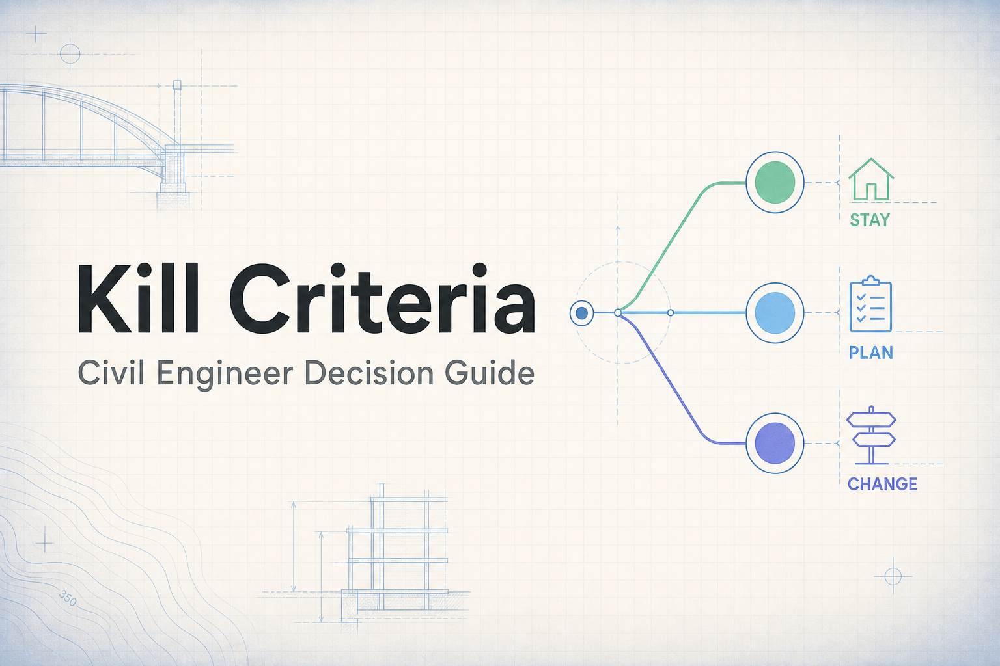

# Kill Criteria

**A calm decision guide for Philippine civil engineers** — one question at a time.

[quit.field-notes.dev](https://quit.field-notes.dev)

Kill Criteria walks you through stressful career decisions using Annie Duke's *kill criteria* framework from [*Quit*](https://www.penguinrandomhouse.com/books/669013/quit-by-annie-duke/): conditions you decide in advance, while you're thinking clearly, that tell you when to stop or change course.

No decision overload. No hype. Just structured reflection.

## What it helps with

| Flow | Question |
|------|----------|
| **Quit job** | Should I leave my current employer? — compensation, growth, environment |
| **Change employer or niche** | Is it the company or the field? — pattern check, passion, niche tracks |
| **Leave civil engineering** | Should I exit the profession? — OFW track, pivot options, clean exit |

Each flow is a guided decision tree with reference material (salary ranges, niche grids, checklists) where it helps — rendered inline, not buried in footnotes.

## Features

- **One question per screen** — mobile-first, thumb-friendly
- **Session persistence** — resume where you left off via `localStorage`; clear progress anytime from the hub
- **Outcome legend** — stay for now · take time to plan · ready for a change
- **Privacy-first** — static client-only app; no accounts, no analytics, no backend
- **Accessible motion** — respects `prefers-reduced-motion`

## Tech stack

- [React 19](https://react.dev/) + [TypeScript](https://www.typescriptlang.org/)
- [Vite 6](https://vite.dev/)
- [React Router 7](https://reactrouter.com/)
- CSS Modules (no Tailwind, no component library)
- Deployed on [Vercel](https://vercel.com) as a static SPA

Decision trees live as plain TypeScript objects in `src/data/` — content changes rarely need component edits.

## Local development

```bash
npm install
npm run dev
```

Open [http://localhost:5173](http://localhost:5173).

### Other commands

```bash
npm run build       # production build
npm run preview     # serve the build locally
npm test            # vitest (unit + component tests)
npm run test:watch  # vitest in watch mode
```

## Deploy

1. Push to GitHub
2. Import the repo in [Vercel](https://vercel.com)
3. Framework preset: **Vite**
4. Deploy — `vercel.json` handles SPA routing and security headers

CI runs on push/PR to `main`: `npm audit`, tests, and build (see [`.github/workflows/ci.yml`](.github/workflows/ci.yml)).

## Project layout

```
src/
  config/         Site config and security headers
  data/           Flow definitions (quitJob, changeEmployer, leaveProfession)
  lib/            Session persistence and validation
  routes/         Hub (landing) and Flow (wizard)
  components/     QuestionCard, OutcomeCard, ReferencePanel, etc.
  hooks/          useFlowState, useReducedMotion
  styles/         Design tokens, global styles, motion
reference/        Source HTML decision trees (content reference)
docs/             Project documentation
```

For AI/agent contributors, see [AGENTS.md](AGENTS.md).

## Disclaimer

Kill Criteria organizes your thinking — it does not tell you what to do. Nothing here is legal, financial, tax, immigration, licensure, or career counseling advice. Your situation is unique; verify facts and talk to qualified professionals before major moves.

Full disclosure: [quit.field-notes.dev/disclosure](https://quit.field-notes.dev/disclosure)

## Credits

- **Framework:** Annie Duke, [*Quit*](https://www.penguinrandomhouse.com/books/669013/quit-by-annie-duke/)
- **Community:** [r/civilengineer_ph](https://www.reddit.com/r/civilengineer_ph/)
- **Built by:** a fellow PH civil engineer · [field-notes.dev](https://www.field-notes.dev)

## Reference files

Static decision trees in [`reference/`](reference/) were the original source for flow content.
